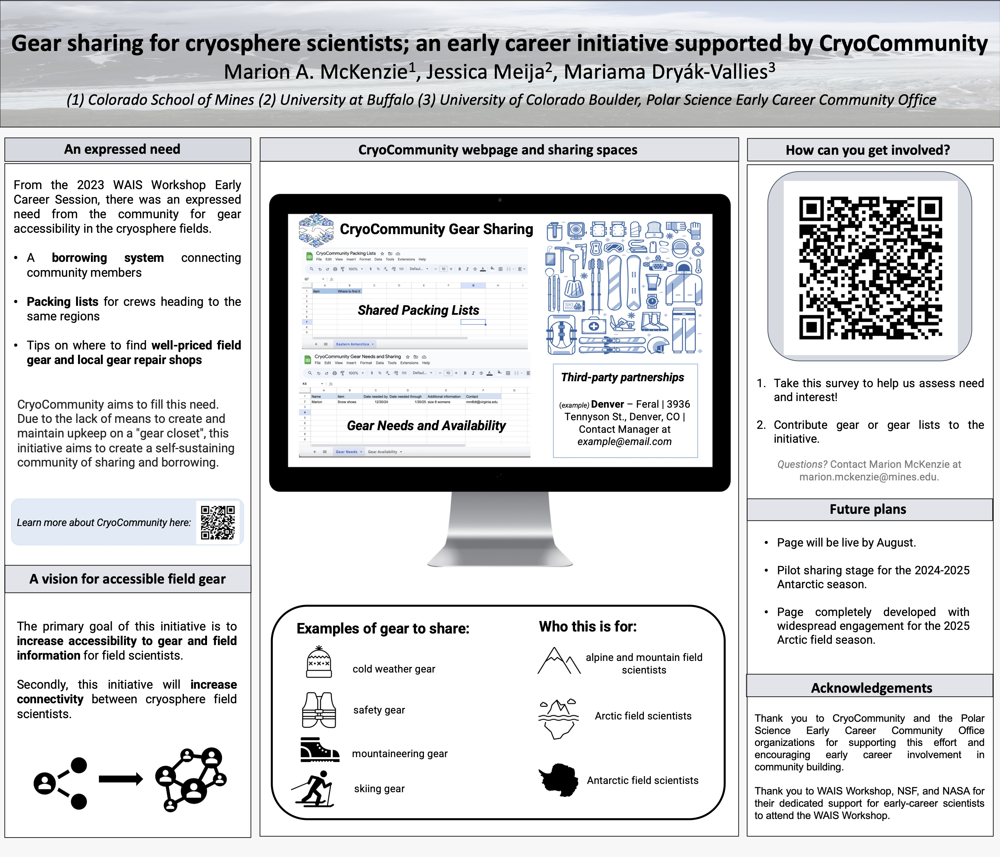
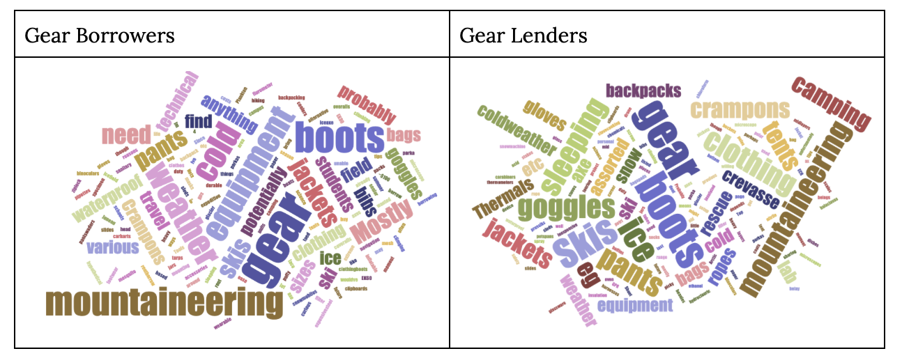

## An expressed need for a gear sharing space

A need for connection to resources regarding gear sharing, packing lists, and a list of local used gear shops was expressed at the last West Antarctic Ice Sheet meeting (WAIS23) by members of the cryosphere community in attendance. To address this need, I am developing a webpage through CryoCommunity with support from Jessica Meija and Mariama Dryak with the Polar Science Early Career Community Office [PSECCO](https://psecco.org/) that will directly connect individuals seeking to borrow gear to those willing to lend gear. Additionally, any region or discipline-specific packing lists for fieldwork are being collected in a separate Google sheet and made available to the community. In April 2024, I presented the preliminary vision for this effort at the Colorado Glaciology Meeting (see below).

The data shared below was collected from anonymous individuals *(n=25)* that volunteered their time to complete a survey regarding gear needs and willingness to share gear. The survey was shared through CryoCommunity and PSECCO social media, cryolist, and the Colorado Glaciology listserv.

## CryoCommunity Gear Sharing and Borrowing Interest Survey Results

These summarized survey results will inform next steps in the development of a webpage that will connect individuals seeking to borrow field gear with individuals willing to lend field gear. This shared community space will also include packing lists for region-specific field work, locations of affordable used or repaired gear in cities across the United States, and lists of ProDeal and other discounts afforded to field-going polar scientists.

The development of this shared resource is meant to *address a gap in field accessibility within the polar sciences*. This need was expressed through early career conversations at the West Antarctic Ice Sheet (WAIS) workshop and through recent publications on the state of inclusion within the cryospheric sciences. Widely sharing packing lists and increasing gear accessibility will improve representation and inclusion within fieldwork in the polar regions (Dance et al., 2024; Robel et al., 2024).

*We aim for this iniative to become self-sustaining* by creating connections across geographically isolated and siloed glaciology departments in lieu of developing and maintaining a localized “gear repository”.

### Logistics of community gear sharing

The word cloud below represents the type of gear survey respondents (n=25) are looking to borrow (n=22) vs. lend (n=20). The majority of respondents indicated the gear they would lend is new, slightly, or well used (94.7%).

Borrowers (n=22) would need to use gear for a length of time between 1 week and 1 month (50%), between 1 and 3 months (45.5%), or for more than 3 months (4.5%). Lenders (n=20) are willing to share gear for 1 week to 1 month (4.5%), between 1 and 3 months (40%), for more than 3 months (15%), or noted the length of time for lending would depend on the situation (40%).

59.1% of borrowers (n=22) indicated they would be willing to pay for all or a portion of postage required to receive gear. 22.7% of borrowers indicated they would be willing to travel to receive gear.

30% of lenders (*n*=20) would be willing to pay for all of the postage required to ship gear, while 50% of lenders would be willing to pay for postage if the borrower was a student. 90% of lenders also indicated they would be willing to meet the borrower in-person if they were local.

#### Listed concerns

- Quality assurance: accurate descriptions of products and specifications for usage
- Receiving the equipment early enough to be able to practice usage
- Sanitation of personal gear and cleanliness upon return
- Timely return of gear after usage
- Breakage or damage of items
- Transparency of the reason for use by the borrower
  
## Future directions

In order to address respondent concerns regarding quality assurance, timeliness of gear receiving/return, transparency of use, sanitation, and responsibility of cost, we will develop a **gear lending agreement template** that users can adapt for their own purposes. While we will **establish general community guidelines** for the gear sharing page, we understand the requirements for particular gear usage may vary widely. With this in mind, those using the page are encouraged to edit the lending agreement to establish expectations for borrowing timelines, responsibility of cost, and other logistical details.

Additional questions from the survey indicated that advice on establishing ProDeals, communicating shared storage availability, and sharing introduction to fieldwork resources and contact information from community members with regional packing lists would be helpful. As the gear sharing page is developed, we will keep all of these suggestions in mind to develop a resource that is most useful to the community.
